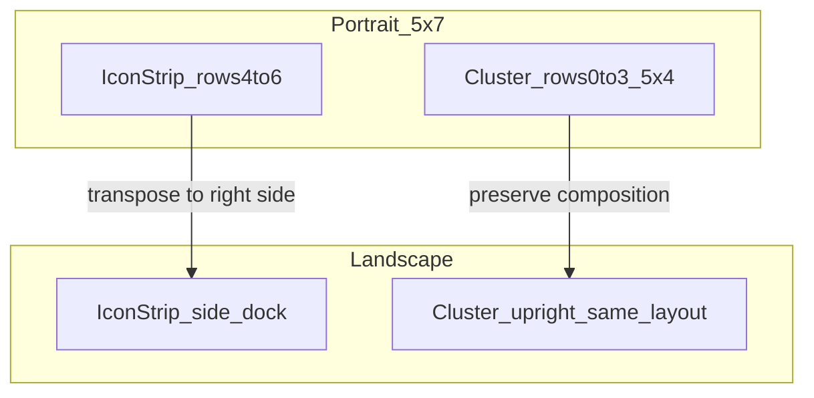

# CTLST Home V2

Current rotation supersedes the historical spring-snap notes below: Home stays
visible and reflows directly when Sway changes size. The frozen-frame renderer
and black guard are retired. See [ROTATION.md](ROTATION.md) for responsive
widget settings and verification.

Source-of-truth redesign for `ctlsthome`: page snap-scroll, a **5×7**
logical grid with an upright **5×4** widget cluster and a **3-row** icon
strip, removable widgets, descriptor-based widget intake, and YAML config
under `~/.config/ctlst`.

Implementation lives in `ctlsthome.c` / `home-config.c` today. This document
freezes the target model and phased TODO. Do not treat live-device layout as
the contract until a phase below lands.

## Goals

- Horizontal page transitions that follow the finger and **snap at 50%** (with
  fling velocity as a second commit path).
- Widgets can be **hidden** or **removed** from the layout without deleting
  their descriptors.
- Rotation: the top **5×4** widget cluster keeps its composition upright; the
  bottom **3** icon rows transpose into a right-side dock in landscape.
- New widgets can be added **without recompiling** `ctlsthome` (descriptor
  intake + optional `exec` helpers).
- All magic numbers (grid size, drag hysteresis, page edge, dwell times, snap
  fraction) live in config with **compiled defaults as fallback**.

## Non-goals (v1)

- Third-party `.so` / GTK module plugins.
- Multi-user or cloud-synced layouts.
- A widget marketplace or remote catalog.
- Replacing `ctlst-preferences` favorites storage in the same change set
  (favorites stay in `preferences.json` until a later migration note).

## Defaults locked here

| Topic | Choice |
| --- | --- |
| Config | YAML at `~/.config/ctlst/home.yaml` |
| Widget intake | Descriptor files + `ctlst-widget-1` NDJSON helpers; not shared libraries |
| Grid | Fixed **5×7** logical cells (portrait coordinates) |
| Rows 0–3 | Widget cluster (5×4) |
| Rows 4–6 | Icons only (3×5 strip) |
| Pages ≥ 1 | Full 5×7 icon pages (or icon strip + empty cluster — see pager phase) |
| Rotation | Widget layout stays upright; icon strip transposes into a right dock |
| Rotation transition | Source-oriented cache zooms out and holds; hidden target paints; completed target springs in |

Existing `~/.config/ctlst/home-layout.json` and `preferences.json` remain until
the migration phase below.

---

## Current vs target

### Current (`ctlsthome.c`)

- Grid: **5×7** via `home->config` (defaults match the old `#define`s).
- Widgets and launcher icons share one `GtkGrid`.
- Page changes are instant (`launcher_swiped` / edge dwell) — no finger-follow
  pager or snap animation.
- Built-in widgets only (`weather`, `clock`, `calendar`, `glance`), hardcoded
  count `HOME_GRID_WIDGETS 4`.
- Orientation preserves the upright cluster and transposes the icon strip.
- The source frame is frozen during an orientation change so GTK can build the
  destination tree out of sight. The transition deliberately uses no opacity
  crossfade.

### Target (portrait)

```text
┌──────────── Page 0 portrait ────────────┐
│  ┌──── 5×4 widget cluster (rows 0–3) ──┐ │
│  │  upright widget composition         │ │
│  └─────────────────────────────────────┘ │
│  ┌──── 3×5 icon strip (rows 4–6) ──────┐ │
│  │  icons only                         │ │
│  └─────────────────────────────────────┘ │
└──────────────────────────────────────────┘
         ◄──── horizontal scroll, snap at 50% ────►
```

### Target (landscape)

```text
┌──── 5×4 widget cluster ────┬── icon dock ──┐
│  Same top / middle / bottom     │ rows 4–6   │
│  composition as portrait.      │ transpose  │
│  Cards and text stay upright.  │ into 3×5   │
└────────────────┴────────────────────────────┘
```



---

## Spatial model

### Logical grid

- Always **5 columns × 7 rows** of equal logical cells (`grid.columns` /
  `grid.rows` in config; defaults `5` / `7`).
- Cell spacing is configurable (`grid.spacing_px`).
- **Cluster region:** rows `0 .. cluster_rows-1` (default `cluster_rows = 4`).
- **Icon strip:** rows `cluster_rows .. rows-1` (default rows `4` through `6`).
- Widgets may only occupy the cluster region (spans that extend into the strip
  are invalid / clamped).
- On page 0, icons occupy the strip. Pages ≥ 1 are icons-only.
- Persist all positions in **portrait-logical** `(column, row)`.

### Config keys for the split

```yaml
grid:
  columns: 5
  rows: 7
  spacing_px: 10
  cluster_rows: 4   # upright widget rows; remaining rows form the app strip
```

`cluster_rows` defaults to `4`. Icon-strip height is `rows - cluster_rows`
(must be ≥ 1; default `3`).

### Page 0 vs later pages

| Page | Cluster (rows 0–3) | Strip (rows 4–6) |
| --- | --- | --- |
| 0 | Widgets | Icons only |
| ≥ 1 | Page-local widgets in rows 0–3; apps in remaining free cells | Same page-local widgets and apps |

### Rotation contract

1. **Store** layout in portrait-logical coordinates. Do not rewrite icon or
   widget indices when the panel rotates.
2. **Widget cluster (5×4):** keep the same logical positions and spans in both
   orientations. Landscape scales that unchanged composition into the left
   content region; cards and text remain upright.
3. **Icon strip (3×5):** on landscape, transpose the bottom strip into a
   right-side 3×5 dock. Icon order and hit targets follow the transposition;
   artwork remains upright.
4. Drag / edit while landscape maps touches back into portrait-logical cells
   before applying layout mutations.

```text
Portrait cell map (column →, row ↓):

  c0 c1 c2 c3 c4
  ─────────────
r0 │           │
r1 │  CLUSTER  │  ← same arrangement in landscape
r2 │   5 × 4   │
r3 │           │
  ─────────────
r4 │  ICON     │  ← transposes to right in landscape;
r5 │  STRIP    │     icons remain upright
r6 │           │
```

---

## Page scroll and animation

Replace swipe-only page flips with a horizontal **pager**:

1. Touch drag updates a continuous page offset (fractional page index or
   pixel offset of a page strip).
2. Adjacent page content is partially visible while dragging.
3. On release:
   - If `|offset| > page.snap_fraction * page_width` (default **0.5**), commit
     to the next/previous page.
   - Else if fling `|velocity| ≥ page.fling_velocity`, commit in the fling
     direction.
   - Else spring back to the current page.
4. Commit / cancel animates over `page.animation_ms`.

Edit-mode edge dwell (drag icon/widget to screen edge to change page) remains,
using `page.edge_px` and `page.edge_dwell_ms`, but should drive the same pager
API rather than an instant `set_launcher_page`.

Normal (non-edit) horizontal swipe uses the pager, not a discrete
`GtkGestureSwipe` page jump.

`CTLST_HOME_PAGER_MOTION=gsk` retains the N-page strip and changes its GTK/GSK
allocation transform during drag. GTK reuses unchanged child layout; picking,
coordinate conversion and rendering share the same translation. Settle runs on
GTK's frame clock. A retained gutter between pages expands the stride
from the padded content width to the physical output width, so the old page
actually clears the screen instead of being hidden by a late clip. `css` is the
emergency fallback. `rotation_host` is the single full-output clip.

The pager observes the whole Home surface in capture phase, including touches
that begin on launcher icons or widgets. Movement beyond tap slop immediately
cancels pending edit/drag arming; horizontal-dominant intent claims paging,
while a stationary release still launches and a stationary hold still enters
edit mode.

---

## Widget lifecycle

### States

| State | Meaning |
| --- | --- |
| `enabled` | Present on the layout (has cell + span). |
| `hidden` | Descriptor known; not shown; can be re-enabled from an add/picker UI. |
| `removed` | Absent from the saved layout; descriptor still on disk / in builtins. |

`hidden` vs `removed`: `hidden` keeps a slot in `home.yaml` / layout for
quick restore; `removed` drops layout entries until the user adds the widget
again.

### Edit mode

The live page zooms out to fit above a separate, full-size toolbar and page
controls. No row is removed from the normal grid and entering/exiting edit
does not rewrite saved positions. GTK allocation transforms keep picking and
drag coordinates aligned with the preview; landscape guides follow the actual
widget cluster and transposed app strip. Dropping into the area below the
preview cancels the move instead of removing an app.

`edit.inset_px: 12` and `edit.controls_gap_px: 12` in
`~/.config/ctlst/home.yaml` set the edit-only outer inset and preview/control
gap (logical pixels, valid range 0–48). Send Home `T` or restart it to reload.
The zoom is an immediate live transform, not a frozen screenshot or a layout
reflow. The normal page returns to scale 1 on Done or `Super+Home`.

- Long-pressing an app, widget, or empty Home space enters layout editing.
- Widgets gain a release-only corner remove control, analogous to launcher
  icon remove. Removal hides the item while retaining its last geometry so it
  can be restored predictably.
- The edit toolbar provides **Add widget**, **Wallpaper**, and **Done**.
- **Add widget** lists removed builtins and discovered external descriptors.
  It places the selection on the currently visible Home page (including pages
  2 and later), and the saved layout records that page. External helpers remain
  stopped until their widget is actually enabled.
- **Wallpaper** opens the shell Settings application at the existing
  wallpaper workflow.
- Hide may be a long-press menu or settings toggle; remove is the destructive
  layout action during edit.

### Persistence

Layout file (versioned; see migration) stores per widget:

- `id`
- `column`, `row`, `column_span`, `row_span`
- `visibility`: `enabled` | `hidden` (omitted / absent ⇒ not on layout)

---

## Widget intake format

### Search path (first match wins per `id`)

1. `~/.config/ctlst/widgets/*.yaml`
2. `~/.local/share/sway-touch/widgets/*.yaml` (deployed from this repo)
3. `/usr/share/ctlst/widgets/*.yaml` (optional packaged path)

Built-in C factories always win for reserved ids: `clock`, `calendar`,
`weather`, `glance`. External descriptors must not reuse those ids.

### Descriptor schema

| Field | Required | Description |
| --- | --- | --- |
| `id` | yes | Stable string key (`[a-z0-9][a-z0-9_-]*`). |
| `name` | yes | Human label. |
| `kind` | yes | `builtin` or `exec`. |
| `protocol` | for `exec` | Must be `ctlst-widget-1`. |
| `interaction` | no | `pointer` (default), `launch`, or `none`. |
| `min_columns` | yes | Minimum column span (≥ 1). |
| `min_rows` | yes | Minimum row span (≥ 1). |
| `default_columns` | no | Default width (defaults to `min_columns`). |
| `default_rows` | no | Default height (defaults to `min_rows`). |
| `exec` | if `kind: exec` | Absolute or PATH command to host the surface / feed. |
| `args` | no | Argument list for `exec`. |
| `mime` | no | Tap opens default app for this MIME type. |
| `desktop` | no | Tap launches this `.desktop` id. |

For v1 `exec` widgets, Home starts the helper without a shell and exchanges
newline-delimited JSON over stdin/stdout. Helpers emit complete declarative
scenes; Home renders them natively with Cairo/Pango and maps release-oriented
pointer input into the scene after aspect fitting. Helpers never create or
position a Wayland surface. The full contract and agent scaffolding live under
`sway-touch/agent/pi/skills/ctlst-app-builder/`. Builtins stay in-process GTK.

### Example descriptor

```yaml
# ~/.config/ctlst/widgets/notes.yaml
id: notes
name: Notes
kind: exec
protocol: ctlst-widget-1
interaction: launch
min_columns: 2
min_rows: 2
default_columns: 2
default_rows: 2
exec: ctlst-home-notes
args: []
desktop: dev.ctlst.Notes.desktop
```

### Validation rules

- Missing `id` / `name` / `kind` → skip file, log once.
- Unknown `kind` → skip.
- `kind: exec` without `exec` or `protocol: ctlst-widget-1` → skip.
- `min_*` / `default_*` must fit in `grid.columns` × `grid.rows`.
- Duplicate `id` across paths → first path wins; warn on collision.

---

## Config schema (`~/.config/ctlst/home.yaml`)

### Load order

1. **Baked defaults** (compiled, matching today’s `#define`s where renamed).
2. **`~/.config/ctlst/home.yaml`** — deep-merge overrides.
3. **Layout file** — positions, spans, visibility, icon cells, page count.

Missing `home.yaml` is valid: run entirely on baked defaults.

### Implementation note

C will need a YAML reader (prefer `libyaml` on Alpine, or a constrained
subset parser if dependency weight is an issue). Spec does not require a
settings GUI in v1; editing the file and sending Home a reload (`T` on the
control socket, same idea as theme reload) is enough.

### Example with defaults

```yaml
# ~/.config/ctlst/home.yaml
version: 1

grid:
  columns: 5
  rows: 7
  spacing_px: 10
  cluster_rows: 4

drag:
  icon_arm_ms: 350
  push_dwell_ms: 280
  cell_switch_fraction: 0.24
  remove_zone_fraction: 0.16

page:
  snap_fraction: 0.5
  fling_velocity: 0.35
  animation_ms: 220
  edge_px: 48
  edge_dwell_ms: 200
  max_pages: 8

rotation:
  transition: spring-snap # use `none` for an immediate compositor transform
  zoom_out_scale: 0.91
  zoom_in_scale: 0.94
  overshoot_scale: 1.015
  cut_ms: 90
  hold_ms: 70
  duration_ms: 230

launcher:
  icon_scale: 1.0
  icon_min_px: 56
  icon_max_px: 56

widgets:
  # Optional allow-list. Omitted = all discovered widgets eligible.
  # An explicit empty list disables external widgets.
  enabled: []
  hidden: []
```

### Key map from current `#define`s

| Today | Config path | Default |
| --- | --- | --- |
| `HOME_GRID_COLUMNS` | `grid.columns` | `5` |
| `HOME_GRID_ROWS` | `grid.rows` | `7` |
| (new) | `grid.cluster_rows` | `4` (upright widget-cluster rows) |
| `HOME_GRID_SPACING` | `grid.spacing_px` | `10` |
| `HOME_ICON_DRAG_ARM_MS` | `drag.icon_arm_ms` | `350` |
| `HOME_PUSH_DWELL_MS` | `drag.push_dwell_ms` | `280` |
| `HOME_GRID_CELL_SWITCH_FRACTION` | `drag.cell_switch_fraction` | `0.24` |
| `HOME_REMOVE_ZONE_FRACTION` | `drag.remove_zone_fraction` | `0.16` |
| `HOME_PAGE_EDGE_PX` | `page.edge_px` | `48` |
| `HOME_PAGE_EDGE_DWELL_MS` | `page.edge_dwell_ms` | `200` |
| `HOME_LAUNCHER_PAGES_MAX` | `page.max_pages` | `8` |
| `HOME_LAUNCHER_ICON_SCALE` | `launcher.icon_scale` | `1.0` |
| `HOME_LAUNCHER_ICON_MIN` / `MAX` | `launcher.icon_min_px` / `icon_max_px` | `56` / `56` |
| (new) | `page.snap_fraction` | `0.5` |
| (new) | `page.fling_velocity` | `0.35` |
| (new) | `page.animation_ms` | `220` |
| (new) | `rotation.transition` | `spring-snap` |
| (new) | `rotation.zoom_out_scale` | `0.91` |
| (new) | `rotation.zoom_in_scale` | `0.94` |
| (new) | `rotation.overshoot_scale` | `1.015` |
| (new) | `rotation.cut_ms` | `90` |
| (new) | `rotation.hold_ms` | `70` |
| (new) | `rotation.duration_ms` | `230` |

Calendar density thresholds (`HOME_CALENDAR_MONTH_MIN_*`) become widget
descriptor / builtin metadata, not global grid config.

---

## Layout migration

| File | Role |
| --- | --- |
| `~/.config/ctlst/home-layout.json` | Current positions (widgets + icons). Keep reading until migrator ships. |
| `~/.config/ctlst/home-layout.yaml` (or versioned JSON) | Target layout with `version: 2`, 5×7 + visibility fields. |
| `~/.config/ctlst/home.yaml` | Tunables + widget enable/hide lists. |

Migrator rules (when implemented):

1. If layout `grid_columns`/`grid_rows` ≠ configured 5×7, clamp/fit widgets
   into the cluster (`rows < cluster_rows`); spill icons into the strip or
   page 1+.
2. Preserve widget ids and relative order when possible.
3. Write `version: 2` and leave a `.bak` of the previous layout once.

Favorites membership stays in `ctlst-preferences` /
`~/.config/ctlst/preferences.json` for v1.

---

## Phased TODO

Use this checklist for implementation PRs. Spec freeze is phase 0.

- [x] **0. Spec + schema freeze** — this document.
- [x] **1. Config loader** — baked defaults + `home.yaml` merge; move
      `#define` tunables behind a `struct home_config`
      (`home-config.c` / `home-config.h`, example at `home.yaml.example`).
- [x] **2. Pager** — finger-follow horizontal scroll, 50% snap, fling,
      spring-back; wire edit-mode edge page changes through the same API.
- [x] **3. Cluster + strip rotation** — keep the 5×7 logical grid and the
      top `cluster_rows` (4) upright; transpose the bottom 3 icon rows into
      the right-side landscape dock; clamp widgets out of the strip.
- [x] **4. Widget hide/remove** — edit affordances; layout visibility;
      picker / re-add path for hidden and removed.
- [x] **5. Descriptor intake** — scan widget dirs; one sample `exec`
      descriptor under `sway-touch/widgets/` deployed by `apply.sh`.
- [x] **5b. External widget runtime** — bounded declarative scene protocol,
      native Home rendering, aspect-fit pointer mapping, scaffold/validator,
      and provider-neutral agent instructions.
- [x] **6. Layout migration** — versioned layout; migrate
      `home-layout.json`; document deprecations.
- [x] **7. Tests** — `sway-touch/tests/` for config merge, snap math,
      descriptor parse, rotation (cluster indices stable; strip docks side).
- [x] **8. Cached-frame rotation transition** — pre-render the source, spring
      it outward, remove it before the compositor cut, commit a clean guard
      frame, synchronize the Sway transform through Home IPC, counter-rotate
      the frozen source into the new allocation for at least three paint frames, and
      reveal the fully allocated destination without a crossfade.

### Suggested test anchors

- Config: missing file → defaults; partial YAML overrides only listed keys;
  defaults remain `columns: 5`, `rows: 7`, `cluster_rows: 4`.
- Snap: offset `0.49` → stay; `0.50` → commit; fling overrides small offset.
- Descriptor: valid sample loads; invalid skipped; builtin id collision
  rejected.
- Rotation: widget `(c,r)` unchanged across orientation; strip icons keep
  strip indices; landscape places strip beside the cluster.

---

## Related paths

| Path | Notes |
| --- | --- |
| [`ctlsthome.c`](ctlsthome.c) | Current implementation |
| [`../README.md`](../README.md) | Session overview |
| `~/.config/ctlst/home.yaml` | Tunables (v2) |
| `~/.config/ctlst/home-layout.json` | Layout today |
| `~/.config/ctlst/widgets/` | User widget descriptors |
| `~/.local/share/sway-touch/widgets/` | Packaged descriptors |
| `/usr/share/ctlst/widgets/` | Optional system package descriptors |
| [`../scripts/ctlst-preferences`](../scripts/ctlst-preferences) | Favorites / wallpaper |

## Modern-UI branch: picker safe areas

Later-page editing repair (2026-09-10): the former snapshot-only pager moved
the image but left GTK input and edit-grid coordinates on page one. Native
allocation transforms now keep pages two and later pickable, including widget
drag/resize and launcher hit tests. The edit guides redraw as the page moves.
`tests/home-page-edit-test.c` checks pages two/three in portrait/landscape,
normal/edit scaling, painted grid guides, widget move/resize calculations and
launcher targeting. Thirty transform updates reuse child layout without a new
content allocation. No saved positions, dotfiles or renderer defaults change.

Home's normal grid and the live scaled edit preview are preserved. The edit
toolbar uses full-size 44px controls. The picker is an unscaled bounded overlay:
it keeps a 12px inset, grows with its content up to 340×320 logical pixels, and
scrolls its widget choices on smaller outputs. Long widget names ellipsize;
the title and Close action remain outside the scroll area. It does not request
a larger Home surface or rewrite widget coordinates to fit.

Native regression tests cover short-landscape allocation, long labels, the
Close hit target and the existing edit-preview input transform. Direct keyboard
navigation of the picker/launcher remains an existing limitation; the shell's
Home action still exits editing. User `home.yaml` and `home-layout.json`
remain authoritative and are not replaced by the redesign.

The default-off embedded agent has its own content/confirmation prototype,
documented in [AGENT-PANEL.md](AGENT-PANEL.md). It does not enable a broker,
change the default grid, or establish full keyboard/landscape integration.

### Edit controls and the expanded dock

Widget editing uses the same small circular remove mark as app editing, inside
a larger transparent target. `button.home-widget-remove` supplies the
44×44 target; its `> label` paints the 22×22 danger-colored circle. These
are logical sizes before the outer edit-preview scale. The top-left target
is clipped to the card's rounded outline. The bottom-right resize marker is
a quiet 24×24 circle with one diagonal arrow; its existing, larger corner
drag region is unchanged. Neither control changes normal card allocations.

Remove controls expose names such as **Remove Weather widget**, with a
description explaining that Add widget restores it. Releases outside the
control, after it is unmapped, or after edit mode ends do nothing. This is
explicitly checked because GTK's
[released signal](https://docs.gtk.org/gtk4/signal.GestureClick.released.html)
reports release coordinates even when a click sequence has stopped. Direct
keyboard navigation/removal remains incomplete; this is not an accessibility
completion claim.

The same selected-theme override paths below customize
`button.home-widget-remove`, `button.home-widget-remove > label` and
`.home-widget-handle`. Keep enough target area for touch when reducing the
painted mark. CSS does not currently redefine the compiled resize hit region.
`tests/home-widget-controls-test.c` checks geometry, accessible names,
transparent-target picking, release guards and actual removal into an isolated
temporary layout. Compile it with Home's normal support sources/libraries;
it sets its own private HOME/XDG paths and removes them on success.

Launcher remove badges now belong to the top-right corner of their grid cell,
not the app artwork. In edit mode, `home-launcher-host.h` reserves a band
beside or above the artwork, choosing whichever preserves more of its size.
The artwork scales down only if needed to fit that remaining area. GTK/GSK
allocation transforms keep the image, badge and hit tests aligned with the
outer edit preview. Normal Home returns to its original centered image size.
The badge never contributes to the grid's size request or rewrites positions.

Badge size/color remain ordinary `.home-launcher-remove-badge` CSS
(default 22×22 logical pixels before the outer edit-preview scale). The host
measures the effective CSS size; no new daemon, timer, bitmap or YAML mode is
introduced. The existing `launcher` preferences size the normal icon host,
still capped by its cell. Their current defaults are scale 1.0 and 56px
minimum/maximum; the older 0.52/16px values in this document were stale, not a
new default being applied to user files. Extremely dense custom grids still
need enough space for usable edit targets.

`tests/home-remove-badge-test.c` compiles with Home's support sources and
libraries, like the allocation-order test. It checks real image/badge bounds,
unchanged normal restoration, GTK picking and the production remove hit test
at five portrait/landscape cell sizes. Run under a disposable Wayland session
with `CTLST_GENERATED_DIR` pointing to a rendered theme. Direct keyboard
removal remains an existing Home limitation; shell Home still exits editing.

The edit controls have 28px of transparent bottom padding, in addition to
Home's existing 28px layer margin. The preview shrinks to the remaining space;
normal Home and saved grid coordinates are unchanged. This keeps the page
buttons above the full 56px task pill even during deliberate hover/scrubbing.
The dock remains usable and bottom-swipe Home still exits editing.
On landscape outputs, the toolbar and page controls share one row when their
measured natural widths fit. They stack on portrait or narrower outputs.
This preserves a useful edit preview on short screens without scaling the
buttons down. The fit includes current CSS padding and native label widths,
not a fixed device-specific breakpoint.

The editable CSS selector is `window#ctlsthome .home-edit-controls`;
`padding-bottom: 28px` is the shipped default. Page buttons use 44px rounded
targets and the shared semantic palette. Their tooltips/accessibility labels
distinguish Add Home page from Remove current Home page. Removal is disabled
on the only page, and Add is disabled at `page.max_pages`. This does not add
keyboard focus to Home's currently nonfocusable editor.

The open picker owns input over the launcher. Its Close/choice controls cannot
fall through to app-cell or remove-badge hit tests underneath, including when
landscape places the icon strip behind the picker. Apps also has a standard
`view-app-grid-symbolic` fallback when the integration's preferred icon is
unavailable; existing theme artwork remains preferred.

Override the selector in `~/.config/ctlst/theme-style.css` and run
`ctlst-session reload`; do not edit the generated stylesheet. No rebuild is
needed for spacing or page-button colors.
